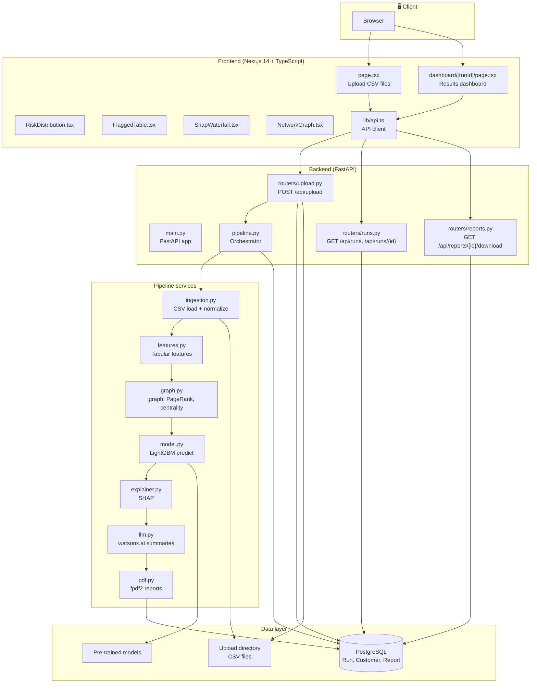
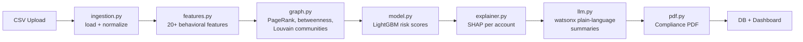
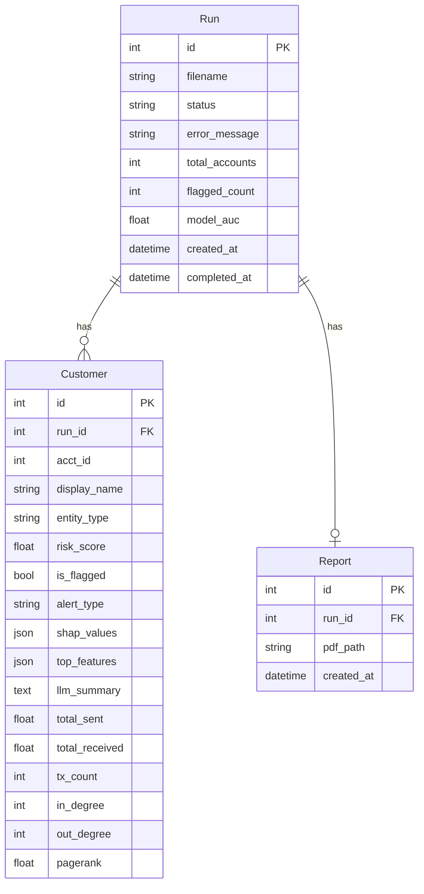
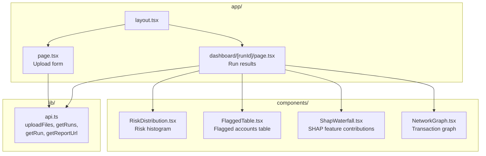

# AML Sentinel — Codebase Architecture

## High-level system diagram



## Pipeline data flow



## Backend module dependency graph

```mermaid
flowchart TB
    main["main.py"]
    config["config.py"]
    database["database.py"]
    models["models.py"]
    schemas["schemas.py"]

    main --> database
    main --> upload
    main --> runs
    main --> reports

    subgraph Routers
        upload["upload.py"]
        runs["runs.py"]
        reports["reports.py"]
    end

    upload --> database
    upload --> models
    upload --> schemas
    upload --> config
    upload --> pipeline

    runs --> database
    runs --> models
    runs --> schemas

    reports --> database
    reports --> models

    pipeline["pipeline.py"] --> database
    pipeline --> models
    pipeline --> ingestion
    pipeline --> features
    pipeline --> graph
    pipeline --> model
    pipeline --> explainer
    pipeline --> llm
    pipeline --> pdf
    pipeline --> config

    subgraph services
        ingestion["ingestion.py"]
        features["features.py"]
        graph["graph.py"]
        model["model.py"]
        explainer["explainer.py"]
        llm["llm.py"]
        pdf["pdf.py"]
    end
```

## Database schema



## Frontend structure



## File tree (AMLI core)

```
AMLI/
├── docker-compose.yml
├── .env.example
├── backend/
│   ├── app/
│   │   ├── main.py          # FastAPI entry, CORS, routers
│   │   ├── config.py        # settings (DB, upload_dir, risk_threshold, watsonx)
│   │   ├── database.py      # SQLAlchemy engine, SessionLocal, Base
│   │   ├── models.py        # Run, Customer, Report
│   │   ├── schemas.py       # Pydantic (UploadResponse, etc.)
│   │   ├── pipeline.py      # run_pipeline() → ingestion→features→graph→model→explainer→llm→pdf
│   │   ├── routers/
│   │   │   ├── upload.py    # POST /api/upload → save files, background run_pipeline
│   │   │   ├── runs.py      # GET /api/runs, GET /api/runs/{id}
│   │   │   └── reports.py   # GET /api/reports/{id}/download
│   │   └── services/
│   │       ├── ingestion.py # load_csv_files, normalize_columns
│   │       ├── features.py  # compute_tabular_features
│   │       ├── graph.py     # compute_graph_features (igraph)
│   │       ├── model.py     # load_pretrained_model, predict_risk_scores
│   │       ├── explainer.py # compute_shap_values
│   │       ├── llm.py       # generate_llm_summary (watsonx)
│   │       └── pdf.py       # generate_pdf_report
│   └── scripts/
│       └── train.py         # Model training (offline)
├── frontend/
│   └── src/
│       ├── app/
│       │   ├── page.tsx
│       │   └── dashboard/[runId]/page.tsx
│       ├── components/
│       │   ├── RiskDistribution.tsx
│       │   ├── FlaggedTable.tsx
│       │   ├── ShapWaterfall.tsx
│       │   └── NetworkGraph.tsx
│       └── lib/
│           └── api.ts
└── data/
    └── run_50K_5M/          # Sample AMLSim CSVs
```

---

*Generated from the AMLI codebase. View this file in a Markdown viewer that supports Mermaid (e.g. VS Code, GitHub) to see the diagrams.*
